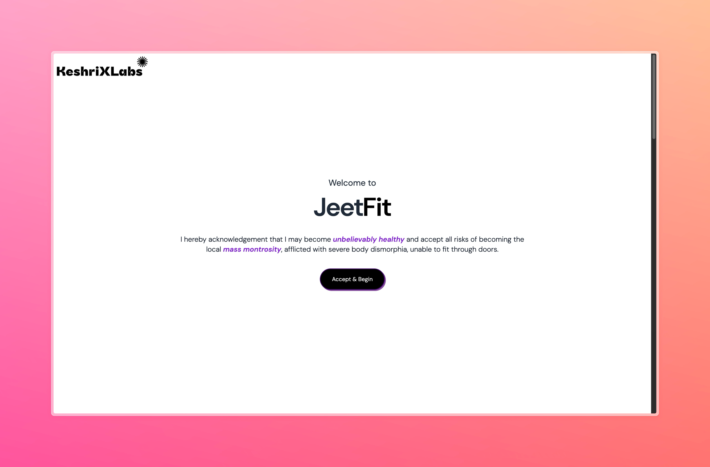

From the works of KeshriXLabs presenting

Jeet Fit (J-Double-E-T-F-I-T) 🏋️‍♂️

Welcome to Jeet Fit, the ultimate fitness platform designed to help you become the greatest version of yourself! Whether you’re aspiring to build an aesthetic physique or looking to improve your strength, endurance, or power, Jeet Fit provides customized workout routines tailored to your fitness goals.

Live demo at: https://jeetfit.netlify.app/

Features 💪

	•	Workout Type Selection: Choose from different types of workouts:
	•	Strength 💥
	•	Power ⚡
	•	Growth / Hypertrophy 📈
	•	Cardiovascular Endurance 🏃‍♂️
	•	Muscle Group Focus: Select the muscle groups you want to target and endure a workout that helps you build your desired physique.
	•	Custom Workouts: Once you’ve selected the workout type and muscle groups, hit the Formulate button, and Jeet Fit will generate a customized workout plan complete with:
	•	Reps (Repetitions)
	•	Rest intervals
	•	Tempo guidance (speed of the movement)
	•	Sets Counter: A built-in counter keeps track of the number of sets you complete to help you stay on top of your progress.

How It Works 🛠️

	1.	Get Started: Ready to become a great bodybuilder? Select the muscle groups you want to work on.
	2.	Choose Your Workout Type: Decide whether you’re focusing on strength, power, hypertrophy, or cardiovascular endurance.
	3.	Formulate Your Plan: After selecting the muscle groups and workout type, hit Formulate to receive a detailed workout plan tailored to your selection.
	4.	Execute: Follow the workout plan, complete the reps and sets, and track your progress with the sets counter.

Installation & Setup 🚀

To run Jeet Fit locally, follow these steps:

	1.	Clone the repository:

git clone https://github.com/keshri-prasanjeet/jeetfit.git

	2.	Navigate to the project directory:

cd jeetfit

	3.	Install the dependencies:

npm install

	4.	Start the development server:

npm start

Technologies Used 🖥️

	•	React: Frontend framework for building dynamic user interfaces
	•	Tailwind CSS: For styling the UI with modern, responsive design
	•	Netlify: Deployed using Netlify for easy, fast, and reliable hosting

Future Enhancements 🔮

	•	Progress Tracking: Allow users to save and track their workout history.
	•	Nutrition Suggestions: Provide tailored nutrition advice based on selected workouts.
	•	Community Section: Introduce a forum where users can share their progress, tips, and advice.

Contributing 🤝

Contributions are welcome! If you have any ideas or improvements, feel free to open an issue or submit a pull request.

License 📄

This project is licensed under the MIT License. See the LICENSE file for more details.

Feel free to modify and add any additional details specific to your project!

